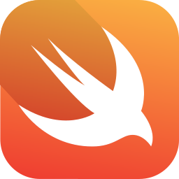
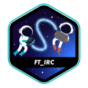

# Who am I?
&nbsp; Hi there, I'm Thales, a not-so-young student at 42 Porto. Born in _1998_ and striving to be a full-fledged developer.
Here you'll be able to see all my academic and personal projects (~~if there are no personal projects you arrived a bit too soon~~).

Furthermore, all the knowledge I gathered will be available in my [Notes](https://github.com/ThalesXS/Notes) project, currently only in portuguese, feel free to take a look.

## Skills

  
  
	
	
	
	
	
	
  
  
  

   
  
  

## 42 Projects

	<h3>Rank 0</h3>
	
	 
	<h3>Rank 1</h3>
	
	
	
	 
	<h3>Rank 2</h3>
	
	
	
	 
	<h3>Rank 3</h3>
	
	
	 
	<h3>Rank 4</h3>
	
	
	 
	<h3>Rank 4 & 5</h3>
	
	 
	<h3>Rank 5</h3>
	
	
	 
	<h3>Rank 6</h3>
	

