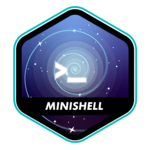

# Who am I?
&nbsp; Hi there, I'm Thales, a not so young student in 42 Porto. Born in *1998* and striving to be a full fledge developer.
Here you'll be able to see all my academic and personal projects (~~if there are no personal projects you arrived a bit too soon~~).

Furthermore, all the knowledge I gathered will be available in my [Notes](https://github.com/ThalesXS/Notes) project, currently only in portuguese, feel free to take a look.

## Skills

  
	
	
	
  
  

  
  

## 42 Projects

	
	 
	
	
	
	 
	
	
	
	 
	
	
	 
	
	
	 
	

